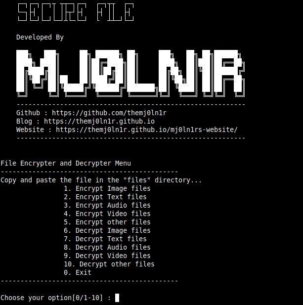

#SecureFiles

SecureFiles is a encryption and decryption tool to share important files over any media.
With this tool we can able to encrypt text files, images, video's, audio's and any other files. And the decryption option is also available to decrypt the files.
This tool should be installed in the both reciever's and sender's system. 
### Requirements

You require these additional modules 

1. base64
2. magic
3. os
4. random

These modules will be pre installed on every system, if not then install them with `pip3 or pip`

>You need to copy your file and paste it in files folder of present in the SecureFiles folder to encrypt or decrypt the file.

### Installation

```text 
git clone https://github.com/TheMj0ln1r/SecureFiles.git
cd SecureFiles
python3 SecureFiles.py
```
### Preview

{: w="600",h="600"}

> If anything should be modified in the script please let me know.
##### Doveloped by Mj0ln1r
##### Website : https://themj0ln1r.github.io/mj0ln1rs-website/
##### Blog : https://themj0ln1r.github.io

